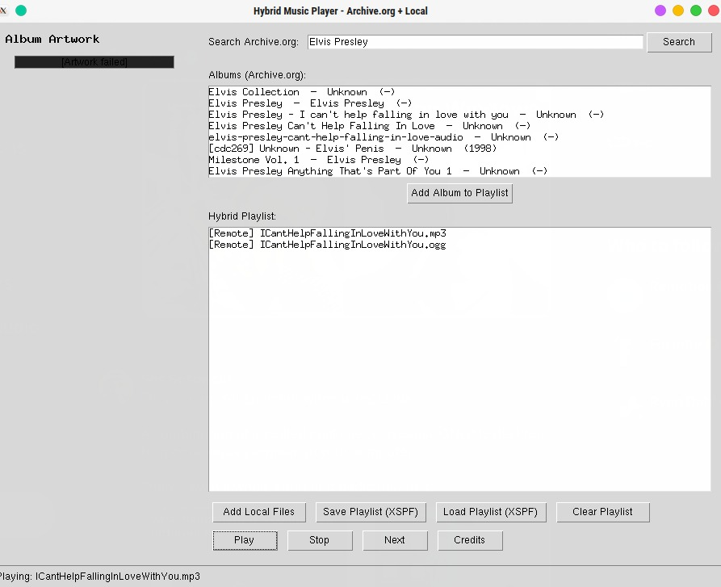
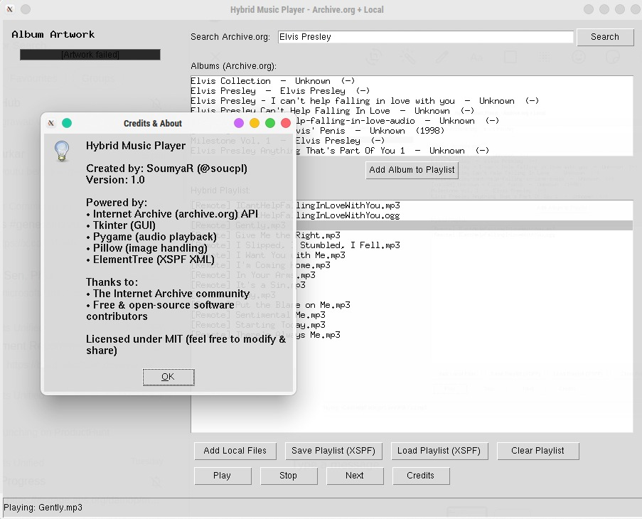

# PxPMusiarc
----

---
Compile it with pyinstaller for an app, made with tkinter or run it as ordinary python code
---
<li>requests</li>
<li>json</li>
<li>pygame</li>
<li>tempfile</li>
<li>time</li>
<li>threading</li>
<li>tkinter</li>
<li>PIL</li>
<li>xml.etree.ElementTree</li>
<li>urllib.parse</li>

---
Add these libraries before compiling or running the file!
---
## ScreenShots
|ScreenShot1|ScreenShot2|
|-----------|------------|
|||
---

